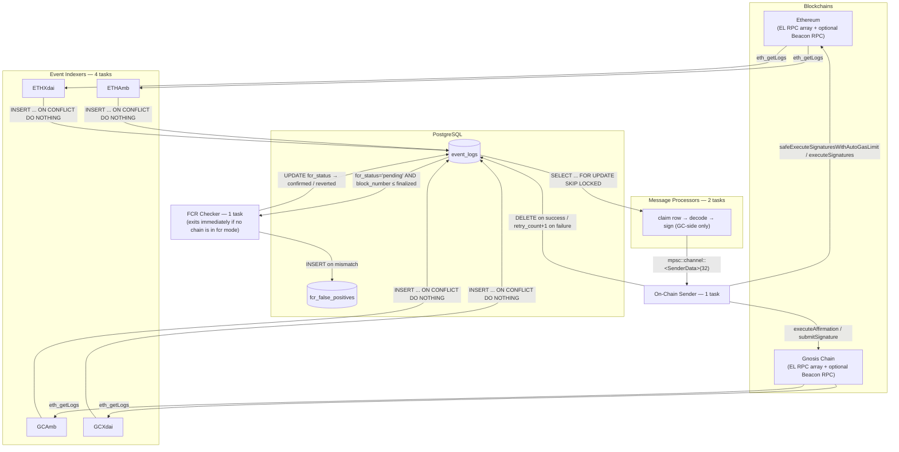
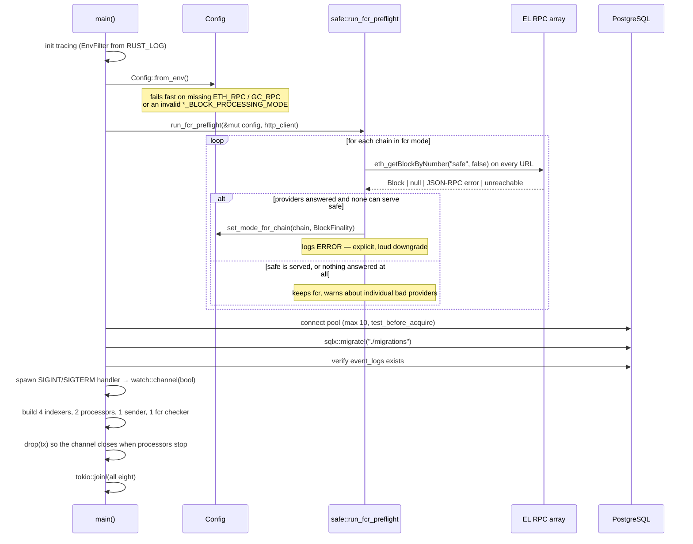
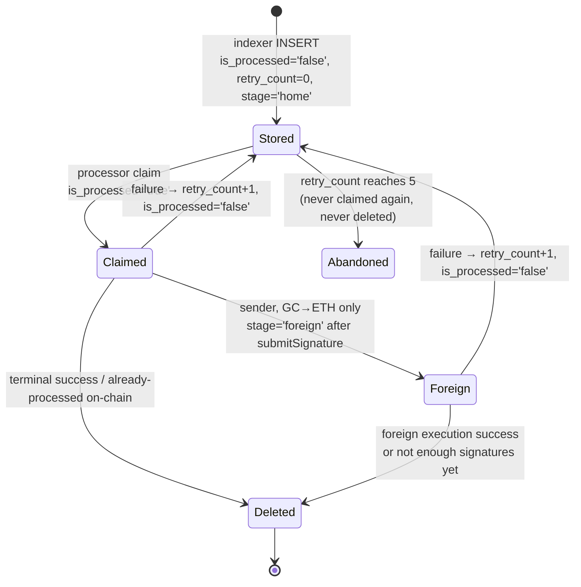
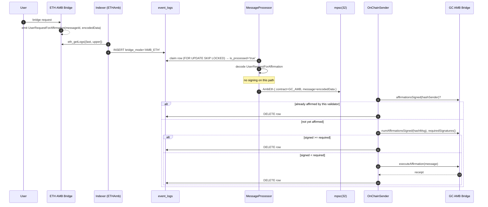
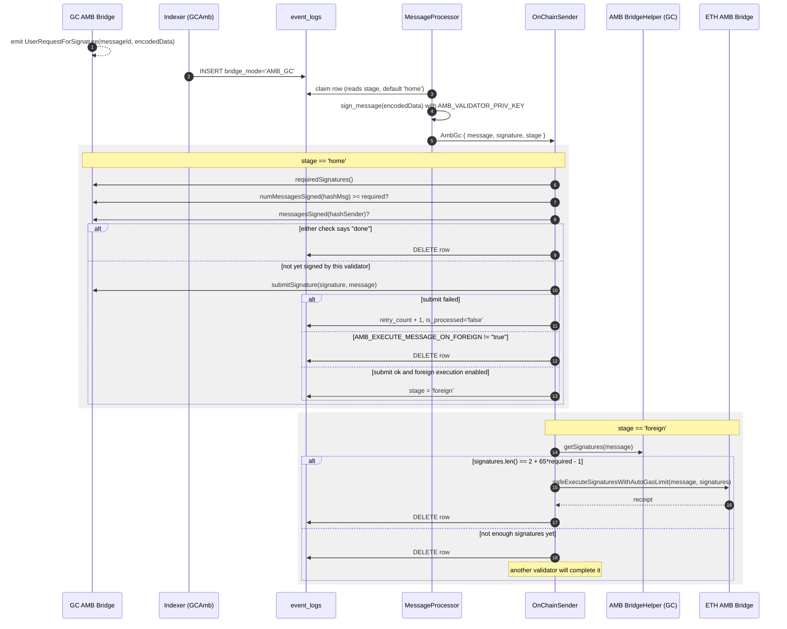
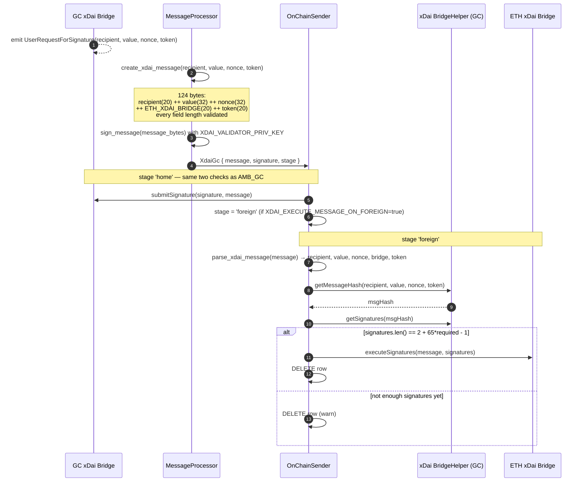
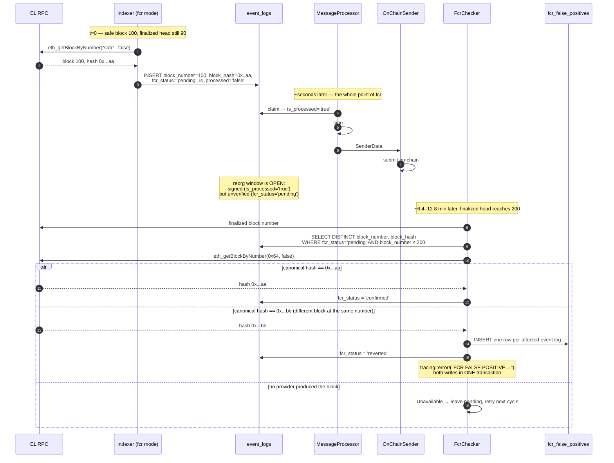

# Technical Workflow

A first-timer's guide to how `bridge-validator` actually works: what each process does, what it
reads, what it writes, and the exact sequence a bridge event follows from an on-chain log to a
relayed transaction — including FCR (Fast Confirmation Rule) mode.

Companion docs:

- [`README.md`](./README.md) — setup, configuration reference, DB schema reference.
- [`FCR_INTEGRATION.md`](./FCR_INTEGRATION.md) — the FCR engineering plan and design decisions.
- [`fcr-agent-reference.md`](./fcr-agent-reference.md) — conceptual background on FCR.
- [`TESTING.md`](./TESTING.md) — how the pipeline is tested.

---

## Table of Contents

1. [What this service is](#1-what-this-service-is)
2. [The four bridge directions](#2-the-four-bridge-directions)
3. [Process topology](#3-process-topology)
4. [Startup sequence](#4-startup-sequence)
5. [Processing units — input / output contracts](#5-processing-units--input--output-contracts)
   - [5.1 Event Indexer](#51-event-indexer-serviceevent_indexerrs)
   - [5.2 Message Processor](#52-message-processor-servicemsg_processorrs)
   - [5.3 On-Chain Sender](#53-on-chain-sender-serviceon_chain_senderrs)
   - [5.4 FCR Checker](#54-fcr-checker-servicefcr_checkerrs)
   - [5.5 Finality resolver](#55-finality-resolver-servicefinalityrs)
   - [5.6 Safe-block resolver](#56-safe-block-resolver-servicesafers)
6. [The shared state: `event_logs`](#6-the-shared-state-event_logs)
7. [Per-event sequence flows](#7-per-event-sequence-flows)
   - [7.1 AMB_ETH](#71-amb_eth--ethereum--gnosis-chain-amb)
   - [7.2 AMB_GC](#72-amb_gc--gnosis-chain--ethereum-amb)
   - [7.3 XDAI_ETH](#73-xdai_eth--ethereum--gnosis-chain-xdai)
   - [7.4 XDAI_GC](#74-xdai_gc--gnosis-chain--ethereum-xdai)
8. [Block processing modes](#8-block-processing-modes)
9. [FCR integration end-to-end](#9-fcr-integration-end-to-end)
10. [Retry, failure and shutdown semantics](#10-retry-failure-and-shutdown-semantics)
11. [Configuration surface](#11-configuration-surface)
12. [Known behavioural gaps](#12-known-behavioural-gaps)

---

## 1. What this service is

`bridge-validator` is a single Rust binary (`bridge_validator/src/main.rs`) that acts as **one
validator** in the Gnosis Chain bridge validator set. It does three jobs, continuously:

1. **Observe** — watch bridge contracts on Ethereum and Gnosis Chain for user bridging requests.
2. **Attest** — for messages that require validator signatures, sign them with the validator key.
3. **Relay** — submit the resulting transaction (affirmation, signature, or final execution) to
   the destination chain.

It is _not_ the bridge. The bridge contracts hold the multi-signature logic; this service only
contributes this validator's share and (optionally) pays the gas for the final execution once
enough validators have signed.

Everything is coordinated through a **PostgreSQL table** (`event_logs`) plus one **in-memory
tokio channel**. There is no external queue, no leader election, and no RPC server.

---

## 2. The four bridge directions

Two bridges (**AMB** — arbitrary messages, **xDai** — native token transfers) × two directions
gives four flows. The code calls these **bridge modes**, stored verbatim in
`event_logs.bridge_mode`:

| bridge_mode | Source chain | Source event                                               | Validator signs? | Destination call                                                  |
| ----------- | ------------ | ---------------------------------------------------------- | ---------------- | ----------------------------------------------------------------- |
| `AMB_ETH`   | Ethereum     | `UserRequestForAffirmation(bytes32,bytes)`                 | No               | `executeAffirmation(message)` on **GC** AMB bridge                |
| `AMB_GC`    | Gnosis Chain | `UserRequestForSignature(bytes32,bytes)`                   | **Yes**          | `submitSignature` on **GC**, then optional execute on **ETH**     |
| `XDAI_ETH`  | Ethereum     | `UserRequestForAffirmation(address,uint256,bytes32)`       | No               | `executeAffirmation(recipient,value,nonce)` on **GC** xDai bridge |
| `XDAI_GC`   | Gnosis Chain | `UserRequestForSignature(address,uint256,bytes32,address)` | **Yes**          | `submitSignature` on **GC**, then optional execute on **ETH**     |

The asymmetry is the key thing to internalise:

- **Foreign → Home (ETH → GC)** uses the **affirmation** model. Each validator independently
  calls `executeAffirmation` on the home (GC) bridge; the contract counts affirmations and
  executes when the threshold is reached. **No off-chain signature is produced.**
- **Home → Foreign (GC → ETH)** uses the **signature collection** model. Each validator signs
  the message off-chain and posts the signature to the _home_ (GC) bridge via
  `submitSignature`. Once enough signatures exist, _someone_ (optionally this validator, gated
  by `*_EXECUTE_MESSAGE_ON_FOREIGN`) fetches them from a helper contract and calls the foreign
  (ETH) bridge to execute.

The bridge mode is derived purely from the **contract address** that emitted the log
(`EventIndexer::check_bridge_mode`), and the chain is derived from the bridge mode
(`EventIndexer::chain`).

---

## 3. Process topology

Eight concurrent tokio tasks, all joined in `main.rs` with `tokio::join!`:



**Why two message processors and one sender?** The processors are the CPU/RPC-bound part
(decode + ECDSA sign) and are safely parallelised by `FOR UPDATE SKIP LOCKED`. The sender is
single because it submits transactions from one key — serialising it avoids nonce races.

**Channel capacity is 32.** If the sender is slow, the channel fills and the processors block on
`send().await`, which is the intended backpressure: rows stay claimed rather than piling up in
memory.

---

## 4. Startup sequence



The preflight exists for exactly one failure mode: an operator sets `ETH_BLOCK_PROCESSING_MODE=fcr`
but points `ETH_RPC` at a client that rejects the `safe` tag. Without the preflight the indexer
would silently fall back to `finalized` every cycle and the operator would believe they had ~12s
confirmation while actually running at ~12.8m.

Note the deliberate asymmetry in the downgrade rule (`ChainSafeSupport::keeps_fcr`): a chain is
downgraded only when providers _answered_ and none would serve `safe`. If **nothing** was
reachable at boot, fcr mode is **kept** — a startup RPC outage is transient, and the per-cycle
resolver already falls back to `finalized` on its own.

---

## 5. Processing units — input / output contracts

### 5.1 Event Indexer (`service/event_indexer.rs`)

Four instances, one per bridge mode. Each owns a `provider` (built by
`rpc_provider::setup_provider`, which wraps multiple URLs in alloy's `FallbackLayer` when more
than one is configured) plus a plain `reqwest::Client` for the raw JSON-RPC finality/safe lookups.

|                     |                                                                                                                              |
| ------------------- | ---------------------------------------------------------------------------------------------------------------------------- |
| **Input**           | `Config`, an alloy `Provider`, a contract address, an event signature string, a `PgPool`, a shutdown `watch::Receiver<bool>` |
| **External reads**  | Beacon RPC `/eth/v2/beacon/blocks/finalized` and/or EL `eth_getBlockByNumber("finalized"\|"safe")`; `eth_getLogs`            |
| **Output**          | Rows in `event_logs`                                                                                                         |
| **In-memory state** | `last_processed_block: u64` — **not persisted**; resets to 0 on restart                                                      |
| **Cadence**         | `POLL_INTERVAL_SECS` (default 10)                                                                                            |

Per cycle:

```
1. upper_bound = resolve_upper_bound()
      fcr mode      → safe::get_safe_block_number(el_rpcs)
                      on Ok(None) or Err → falls back to finalized, logs loudly
      finality mode → finality::get_finalized_block_number(beacon, el_rpcs)
   On error: skip this cycle entirely, keep the cursor where it is.

2. if upper_bound <= last_processed_block → nothing to do

3. start_block = (last_processed_block == 0) ? upper_bound : last_processed_block + 1
   eth_getLogs(address, event, from=start_block, to=upper_bound)

4. for each log:
      skip if log_index is None      (WARN — an unfinalized/pending log)
      skip if topics[0] is None      (WARN)
      INSERT ... ON CONFLICT (transaction_hash, log_index) DO NOTHING

5. last_processed_block = upper_bound
```

Two behaviours worth knowing:

- **Cold start indexes exactly one block.** With `last_processed_block == 0`, `start_block`
  equals `upper_bound`, so the first cycle queries the single block `[upper, upper]`. There is no
  backfill of history — the `TODO: Or config.start_block` in the source marks this. A restart
  therefore skips everything between the last-seen block and the current bound, _except_ for rows
  already persisted before the restart, which are picked up by the message processor from the DB.
- **The cursor advances to the bound, never to the chain tip.** Blocks between the bound and the
  tip are simply revisited on a later cycle; they are never skipped.

The inserted row's `fcr_status` follows **the chain's configured mode, not the bound this
particular cycle happened to use**: `Fcr` → `'pending'`, `BlockFinality` → `NULL`. So if an fcr
chain transiently falls back to `finalized` for one cycle, those rows still enter the
revalidation lifecycle — conservative, and cheap (they confirm immediately).

---

### 5.2 Message Processor (`service/msg_processor.rs`)

Two identical instances competing over the same table.

|                 |                                                                                         |
| --------------- | --------------------------------------------------------------------------------------- |
| **Input**       | Rows from `event_logs` where `is_processed = 'false' AND retry_count < MAX_RETRY_COUNT` |
| **Output**      | `SenderData { on_chain_calldata, event_log_id, stage }` on the mpsc channel             |
| **Side effect** | Sets `is_processed = 'true'` on claim, in the same transaction as the read              |
| **Cadence**     | Tight loop; sleeps 5s when the table has no claimable row                               |
| **Signing**     | Only for `AMB_GC` and `XDAI_GC`                                                         |

The claim query is the concurrency primitive:

```sql
SELECT id, topic_key, bridge_mode, log_data, block_number,
       transaction_hash, is_processed, retry_count, stage
FROM event_logs
WHERE is_processed = 'false' AND retry_count < $1   -- config.max_retry_count, default 5
ORDER BY block_number ASC, log_index ASC
LIMIT 1
FOR UPDATE SKIP LOCKED;
-- then, same transaction:
UPDATE event_logs SET is_processed = 'true' WHERE id = $1;
```

`FOR UPDATE SKIP LOCKED` means processor B walks past the row processor A is holding rather than
blocking on it. Ordering by `(block_number, log_index)` keeps processing roughly chronological.

**It does not re-check finality, and it does not look at `fcr_status`.** That is by design: in
`block-finality` mode every stored row is already final by construction, and in `fcr` mode signing
a not-yet-final row _is the feature_. The reorg window is closed after the fact by the FCR
checker, not before the fact here.

Per bridge mode, the processor:

- `AMB_ETH` → decode `UserRequestForAffirmation`, emit `OnChainCallData::AmbEth { message }`.
  **No signature.**
- `AMB_GC` → decode `UserRequestForSignature`, `sign_message(encodedData)` with
  `AMB_VALIDATOR_PRIV_KEY`, emit `AmbGc { message, signature }`.
- `XDAI_ETH` → decode `UserRequestForAffirmation`, emit `XdaiEth { recipient, value, nonce }`.
  **No signature.**
- `XDAI_GC` → build the 124-byte xDai message (below), sign it with `XDAI_VALIDATOR_PRIV_KEY`,
  emit `XdaiGc { message, signature }`.

**The xDai message layout** (`create_xdai_message`, 124 bytes / 250 hex chars with `0x`):

```
| recipient (20) | value (32) | nonce (32) | eth_xdai_bridge_address (20) | token (20) |
```

Every field length is validated before concatenation, and the total is asserted, so a malformed
message can never reach a signature. `OnChainSender::parse_xdai_message` is the exact inverse and
is used later to reconstruct the arguments for the helper contract.

The `stage` field is read from the row (`'home'` when unset) and carried through the channel —
this is what makes a partially-completed GC→ETH flow resumable.

---

### 5.3 On-Chain Sender (`service/on_chain_sender.rs`)

One instance. Consumes the channel until it closes (which happens once both processors stop and
`main`'s original `tx` has been dropped), then drains and exits.

|                     |                                                                                                                                       |
| ------------------- | ------------------------------------------------------------------------------------------------------------------------------------- |
| **Input**           | `SenderData` from the mpsc channel                                                                                                    |
| **External reads**  | View calls on the bridge / helper contracts (pre-flight checks)                                                                       |
| **External writes** | `executeAffirmation`, `submitSignature`, `safeExecuteSignaturesWithAutoGasLimit`, `executeSignatures`                                 |
| **Output**          | `DELETE` the row on terminal success, or `retry_count + 1, is_processed='false'` on failure, or `stage='foreign'` on partial progress |

It builds a **fresh wallet-bearing provider per message** via
`ProviderBuilder::new().wallet(signer).connect(...)`, using only `config.get_gc_rpc()` /
`get_eth_rpc()` — i.e. **the first URL in each array**. The fallback layer used by the indexers
does _not_ apply to transaction submission.

Every path runs pre-flight view calls before spending gas. They mirror the `require` statements
inside the bridge contracts, so a transaction that would revert is skipped instead of submitted:

| Path            | Pre-flight checks                                                                           |
| --------------- | ------------------------------------------------------------------------------------------- |
| `AmbEth`        | `!affirmationsSigned(hashSender)` → `numAffirmationsSigned(hashMsg) < requiredSignatures()` |
| `AmbGc` (home)  | `numMessagesSigned(hashMsg) < requiredSignatures()` → `!messagesSigned(hashSender)`         |
| `XdaiEth`       | `!affirmationsSigned(hashSender)` → `numAffirmationsSigned(hashMsg) < requiredSignatures()` |
| `XdaiGc` (home) | `numMessagesSigned(hashMsg) < requiredSignatures()` → `!messagesSigned(hashSender)`         |

where, matching the Solidity:

```
hashMsg    = keccak256(message)                         // AMB & XDAI_GC
hashMsg    = keccak256(recipient ++ value ++ nonce)     // XDAI_ETH
hashSender = keccak256(msg.sender ++ hashMsg)
```

---

### 5.4 FCR Checker (`service/fcr_checker.rs`)

One instance. **Exits immediately (logging an info line) if no chain is in `fcr` mode**, so
`block-finality` deployments pay nothing for it.

|                    |                                                                                                       |
| ------------------ | ----------------------------------------------------------------------------------------------------- |
| **Input**          | `event_logs` rows with `fcr_status = 'pending'`                                                       |
| **External reads** | Finalized block (beacon-first), then `eth_getBlockByNumber(<number>, false)` per pending block        |
| **Output**         | `fcr_status` → `'confirmed'` \| `'reverted'`; rows in `fcr_false_positives`; `tracing::error!` alerts |
| **Cadence**        | `FCR_CHECK_INTERVAL_SECS` (default 30)                                                                |

Per chain, per cycle:

```
1. finalized = finality::get_finalized_block_number(beacon, el_rpcs)
2. report_backlog()  → WARN if > 100 rows are still pending on this chain
3. pending = SELECT DISTINCT block_number, block_hash
             FROM event_logs
             WHERE bridge_mode = ANY(modes_for_chain)
               AND fcr_status = 'pending'
               AND block_number IS NOT NULL AND block_hash IS NOT NULL
               AND block_number <= finalized
             ORDER BY block_number ASC
   (also counts pending rows with a NULL block_hash and logs ERROR — that is an
    indexer bug, and those rows stay pending rather than being silently confirmed)
4. for each pending block:
      canonical = safe::get_canonical_block_hash(el_rpcs, block_number)
      canonical == stored          → Confirmed   → UPDATE fcr_status='confirmed'
      canonical != stored          → Reverted    → record_false_positive() (one transaction)
      no provider produced a block → Unavailable → leave pending, retry next cycle
```

Three design rules encoded here:

- **Group by block, not by event.** One RPC call per distinct `(block_number, block_hash)`, not
  one per log.
- **Anchor on the block _number_, compare the _hash_.** EL block numbers are contiguous, so an
  orphaned block manifests as _a different block occupying the same number_. Never compare a
  stored EL hash against a beacon block root.
- **Never prune on `Unavailable`.** A dropped row would be indistinguishable from a verified one.

`record_false_positive` writes the audit rows **and** flips `fcr_status` in a single transaction,
so an alert can never be lost while the rows are quietly marked resolved.

---

### 5.5 Finality resolver (`service/finality.rs`)

Shared by the indexers and the FCR checker so they can never disagree about what "finalized"
means.

```
get_finalized_block_number(beacon_rpc, el_rpcs) -> Result<i64>
  1. if beacon configured: GET {bc}/eth/v2/beacon/blocks/finalized
       → data.message.body.execution_payload.block_number   (EL number, note)
  2. else / on failure: for each el_rpc in order:
       eth_getBlockByNumber("finalized", false) → result.number
  3. all failed → Err(AllRpcsFailedForFinalizedBlock)
```

The beacon response is deserialised into a struct where nearly every field is `Option` with
`#[serde(default)]` — only `execution_payload.block_number` is mandatory, so client-to-client
schema drift doesn't break finality resolution.

---

### 5.6 Safe-block resolver (`service/safe.rs`)

FCR's counterpart to the above, and **execution-layer only** — there is no Beacon API `safe`
block id on any client.

Its distinguishing job is telling two kinds of "no block" apart. `probe_safe_block` classifies
each provider response into `SafeProbe`:

| Variant               | Trigger                                    | Meaning                                                                                       |
| --------------------- | ------------------------------------------ | --------------------------------------------------------------------------------------------- |
| `Block(n)`            | `result.number` present                    | Provider supports `safe` and has one                                                          |
| `Empty`               | HTTP 200, no `error`, `result: null`       | Legitimately no safe block yet (FCR off, syncing, pre-merge) — fall back to finalized quietly |
| `Unsupported(reason)` | a non-null JSON-RPC `error` object         | **Misconfiguration** — this provider can never serve fcr                                      |
| `Unreachable(reason)` | transport error, non-2xx, unparseable body | Says nothing about `safe` support                                                             |

The discriminator is **the presence of a JSON-RPC `error` object, never the null-ness of `result`
alone.** That distinction is what makes the boot preflight trustworthy: `Empty` keeps fcr on,
`Unsupported` on every provider turns it off.

Three entry points:

- `get_safe_block_number(el_rpcs)` → `Ok(Some(n))` / `Ok(None)` (saw a legitimate empty) /
  `Err(AllRpcsFailedForSafeBlock)`.
- `get_canonical_block_hash(el_rpcs, number)` → lowercased hash, or `Ok(None)` if a provider
  answered but had no such block, or `Err` if nothing answered at all.
- `preflight_safe_support` / `run_fcr_preflight` → the boot-time capability check described in
  [§4](#4-startup-sequence).

---

## 6. The shared state: `event_logs`

Every hand-off between units happens through this table. Schema after all four migrations:

| Column             | Type        | Written by            | Meaning                                                                                                      |
| ------------------ | ----------- | --------------------- | ------------------------------------------------------------------------------------------------------------ |
| `id`               | `SERIAL PK` | DB                    | Row identity; carried through the channel as `event_log_id`                                                  |
| `topic_key`        | `TEXT`      | indexer               | `topics[0]` — the event signature hash                                                                       |
| `bridge_mode`      | `TEXT`      | indexer               | `AMB_ETH` \| `AMB_GC` \| `XDAI_ETH` \| `XDAI_GC`                                                             |
| `log_data`         | `JSONB`     | indexer               | The full serialised alloy `Log`; re-decoded by the processor                                                 |
| `block_number`     | `BIGINT`    | indexer               | EL block number                                                                                              |
| `block_hash`       | `TEXT`      | indexer               | EL block hash — a real column (not just inside `log_data`) because the FCR checker groups and compares on it |
| `transaction_hash` | `TEXT`      | indexer               | Source tx                                                                                                    |
| `log_index`        | `BIGINT`    | indexer               | Unique within a block; part of the uniqueness constraint                                                     |
| `is_processed`     | `TEXT`      | processor / sender    | `'false'` → claimable, `'true'` → claimed. Reset to `'false'` by a retry                                     |
| `retry_count`      | `INT`       | sender                | Incremented on failure; the processor stops claiming at `>= 5`                                               |
| `stage`            | `TEXT`      | sender                | `'home'` (default) \| `'foreign'` — resume point for GC→ETH flows                                            |
| `fcr_status`       | `TEXT`      | indexer / fcr checker | `NULL` (finality mode) \| `'pending'` \| `'confirmed'` \| `'reverted'`                                       |
| `created_at`       | `TIMESTAMP` | DB                    |                                                                                                              |

**Uniqueness: `UNIQUE (transaction_hash, log_index)`.** Migration `003` replaced the original
`UNIQUE(topic_key, transaction_hash)`, which silently dropped the second of two same-type logs in
one transaction — `topic_key` is only the event signature, so both shared a key and
`ON CONFLICT DO NOTHING` discarded one. This is why the indexer refuses to insert a log with a
missing `log_index` rather than writing `NULL`.

**`fcr_false_positives`** is a durable, append-only audit table — one row per affected event log,
with `chain`, `block_number`, `stored_block_hash`, `canonical_block_hash`, `transaction_hash`,
`log_index`, `event_log_id`, `detected_at_finalized`, `created_at`. It survives the deletion of
the `event_logs` row it refers to.

**Row lifecycle:**



---

## 7. Per-event sequence flows

### 7.1 `AMB_ETH` — Ethereum → Gnosis Chain (AMB)



**Input:** `UserRequestForAffirmation(bytes32 indexed messageId, bytes encodedData)` on
`ETH_AMB_BRIDGE_ADDRESS`.
**Output:** `executeAffirmation(encodedData)` on `GC_AMB_BRIDGE_ADDRESS`, signed by
`AMB_VALIDATOR_PRIV_KEY`.

---

### 7.2 `AMB_GC` — Gnosis Chain → Ethereum (AMB)

This is the only two-stage flow (shared in shape with `XDAI_GC`).



**Input:** `UserRequestForSignature(bytes32 indexed messageId, bytes encodedData)` on
`GC_AMB_BRIDGE_ADDRESS`.
**Intermediate output:** `submitSignature(sig, encodedData)` on the **GC** bridge.
**Final output (optional):** `safeExecuteSignaturesWithAutoGasLimit(message, signatures)` on
`ETH_AMB_BRIDGE_ADDRESS`, gated by `AMB_EXECUTE_MESSAGE_ON_FOREIGN=true`.

The `stage` column is what makes this resumable: if the process dies after `submitSignature`
succeeded but before the ETH execution, the row comes back with `stage='foreign'` and the sender
skips straight to the foreign leg — it never double-submits a signature.

---

### 7.3 `XDAI_ETH` — Ethereum → Gnosis Chain (xDai)

Structurally identical to `AMB_ETH`, with a different hash preimage and calldata.

**Input:** `UserRequestForAffirmation(address recipient, uint256 value, bytes32 nonce)` on
`ETH_XDAI_BRIDGE_ADDRESS`.
**Processing:** decode only, **no signing**.
**Pre-flight:** `affirmationsSigned(hashSender)` where
`hashMsg = keccak256(recipient ++ value_be32 ++ nonce)`; then
`numAffirmationsSigned(hashMsg) < requiredSignatures()`.
**Output:** `executeAffirmation(recipient, value, nonce)` on `GC_XDAI_BRIDGE_ADDRESS`, signed by
`XDAI_VALIDATOR_PRIV_KEY`.

The "already affirmed by this validator" branch deletes the row, as it does on `AMB_ETH`.

---

### 7.4 `XDAI_GC` — Gnosis Chain → Ethereum (xDai)

Same two-stage shape as `AMB_GC`, but the message is constructed by the validator rather than
taken from the event, and the foreign leg needs an extra helper round-trip.



**Input:** `UserRequestForSignature(address recipient, uint256 value, bytes32 nonce, address token)`
on `GC_XDAI_BRIDGE_ADDRESS`.
**Output:** `submitSignature` on GC, then optionally `executeSignatures(message, signatures)` on
`ETH_XDAI_BRIDGE_ADDRESS`.

The difference from AMB on the foreign leg: the AMB helper takes the **message** directly
(`getSignatures(bytes)`), while the xDai helper takes a **hash** (`getSignatures(bytes32)`), so
the sender must first reconstruct the four fields from the 124-byte message and ask the helper to
compute the hash.

---

## 8. Block processing modes

Selected **per chain** via `ETH_BLOCK_PROCESSING_MODE` / `GC_BLOCK_PROCESSING_MODE`. All indexers
on a chain share its mode — both bridges on a side move together. An unrecognised value is a
**startup error**, not a silent default: a typo must not hand back the conservative mode an
operator believes they turned off.

| Mode                       | Upper bound                | Source                                    | Latency   | Guarantee                                                                                |
| -------------------------- | -------------------------- | ----------------------------------------- | --------- | ---------------------------------------------------------------------------------------- |
| `block-finality` (default) | latest **finalized** block | Beacon API first, EL `finalized` fallback | ~12.8 min | Economic finality — a stored row can never leave the canonical chain                     |
| `fcr`                      | latest **safe** block      | EL `eth_getBlockByNumber("safe")` only    | ~12 s     | Conditional (honest-majority, no slashing backing) — a safe block **can** be reorged out |

The mode changes exactly two things:

1. **which block the indexer stops at** (`resolve_upper_bound`), and
2. **whether the inserted row gets `fcr_status = 'pending'`**.

The message processor and on-chain sender have **no mode-specific logic at all**. They sign and
submit whatever is claimable. This is deliberate: FCR is purely additive, and the reorg window is
closed after the fact rather than gated before it.

---

## 9. FCR integration end-to-end

FCR deliberately opens a reorg window in the signing path. A signature cannot be un-signed, so
the checker does not try to undo anything — it **detects** the one real FCR failure mode, a
**false confirmation**: a block marked safe that later turns out not to be on the canonical chain.



### FCR status semantics

| `fcr_status`  | Meaning                                                                                      |
| ------------- | -------------------------------------------------------------------------------------------- |
| `NULL`        | Row was indexed in `block-finality` mode. Nothing to revalidate.                             |
| `'pending'`   | Indexed from a `safe` block, awaiting finalization. **May already be signed and submitted.** |
| `'confirmed'` | The finalized canonical hash at that block number matched what was stored.                   |
| `'reverted'`  | The canonical hash differed. A false positive was recorded. **Nothing is undone on-chain.**  |

### What operators should alert on

- `tracing::error!` containing `FCR FALSE POSITIVE` — the actual incident.
- Any new row in `fcr_false_positives`.
- `[fcr-checker:<chain>] N rows are awaiting revalidation (threshold 100)` — the checker is not
  keeping up with the indexer, or finality has stalled; unverified signed messages are piling up.
- `[fcr-preflight:<chain>] ... downgrading this chain to 'block-finality'` — fcr was requested but
  is not actually running.
- `finalized pending row(s) have no stored block_hash and cannot be revalidated` — an indexer bug;
  those rows stay pending rather than being silently confirmed.

### The reorg-window invariant

The property FCR trades on, asserted directly in `tests/fcr_e2e_test.rs`, is the **ordering**:
`is_processed = 'true'` while `fcr_status` is still `'pending'`. If the pipeline ever started
waiting for `'confirmed'` before signing, FCR would silently degrade to finality latency while
every per-component test still passed.

---

## 10. Retry, failure and shutdown semantics

**Retry.** Any submission failure calls `increment_retry_count`, which sets
`retry_count = retry_count + 1, is_processed = 'false'` — putting the row back in the claimable
pool. The processor's `WHERE retry_count < $1` is the ceiling, bound from `MAX_RETRY_COUNT`
(default 5). A row that reaches the ceiling is never claimed again and is never deleted; it stays
in the table as a permanent record of a failed message and must be inspected manually. Raising
`MAX_RETRY_COUNT` brings such rows back into the claim set on the next pass.

The same release happens one level up: `OnChainSender::start` calls `increment_retry_count` for
any error that propagates out of `process_message` — a failed view call, an RPC connect failure, a
missing validator key. Those paths skip every terminal branch inside `process_message`, so without
that the row would stay claimed (`is_processed = 'true'`) and never be seen again. If the release
UPDATE itself fails the sender logs it and moves on; that row does stay claimed.

There is **no backoff** — a failing row is re-claimed on the next processor pass. A permanently
failing message (a bad key, say) therefore burns its whole retry budget in a burst and then parks
at the ceiling.

**Errors that skip vs. errors that retry:**

| Situation                               | Behaviour                                                                                                                         |
| --------------------------------------- | --------------------------------------------------------------------------------------------------------------------------------- |
| Upper-bound resolution fails            | Indexer skips the whole cycle; cursor unchanged; nothing lost                                                                     |
| Log has no `log_index` / no `topics[0]` | Log is skipped with a `WARN`; not stored                                                                                          |
| Duplicate `(tx_hash, log_index)`        | `ON CONFLICT DO NOTHING` — idempotent re-index                                                                                    |
| Pre-flight says "already done on-chain" | Row deleted                                                                                                                       |
| `send()` / `get_receipt()` fails        | `retry_count + 1`                                                                                                                 |
| Not enough signatures collected yet     | Row deleted with a `WARN` — another validator finishes it                                                                         |
| Contract view call fails                | Propagates out of `process_message`; `start()` logs it and calls `increment_retry_count`, releasing the claim → `retry_count + 1` |

**Shutdown.** SIGINT/SIGTERM flips a `watch::channel(bool)` observed by all four indexers, both
processors, and the FCR checker. Each breaks out of its loop at the next `tokio::select!` point.
The `main` function drops its original channel sender at startup, so once both processors exit the
channel closes, `OnChainSender::start` drains whatever is left and returns, and `tokio::join!`
completes. In-flight transactions are allowed to finish; the row is only deleted after the
receipt.

---

## 11. Configuration surface

| Variable                                                                                               | Required | Default           | Used by                                                                                          |
| ------------------------------------------------------------------------------------------------------ | -------- | ----------------- | ------------------------------------------------------------------------------------------------ |
| `ETH_RPC`, `GC_RPC`                                                                                    | **Yes**  | —                 | Everything. Comma-separated; >1 URL enables alloy's `FallbackLayer` for indexer reads            |
| `ETH_BC_RPC`, `GC_BC_RPC`                                                                              | No       | unset (warns)     | `finality.rs` — beacon-first finality; falls back to the EL array                                |
| `DATABASE_URL`                                                                                         | **Yes**  | —                 | `main.rs` (read directly from env, not via `Config`)                                             |
| `AMB_VALIDATOR_PRIV_KEY`                                                                               | For AMB  | —                 | Signing (`AMB_GC`) and all AMB transactions                                                      |
| `XDAI_VALIDATOR_PRIV_KEY`                                                                              | For xDai | —                 | Signing (`XDAI_GC`) and all xDai transactions                                                    |
| `ETH_AMB_BRIDGE_ADDRESS`, `GC_AMB_BRIDGE_ADDRESS`, `ETH_XDAI_BRIDGE_ADDRESS`, `GC_XDAI_BRIDGE_ADDRESS` | No       | mainnet addresses | Indexer targets + bridge-mode derivation                                                         |
| `AMB_BRIDGE_HELPER_ADDRESS`, `XDAI_BRIDGE_HELPER_ADDRESS`                                              | No       | mainnet addresses | Foreign-leg signature collection                                                                 |
| `ETH_BLOCK_PROCESSING_MODE`, `GC_BLOCK_PROCESSING_MODE`                                                | No       | `block-finality`  | Indexer upper bound + `fcr_status`. Invalid value = startup failure                              |
| `POLL_INTERVAL_SECS`                                                                                   | No       | `10`              | Indexer cadence. `0` or unparseable → warns and uses 10                                          |
| `FCR_CHECK_INTERVAL_SECS`                                                                              | No       | `30`              | FCR checker cadence. `0` or unparseable → warns and uses 30                                      |
| `AMB_EXECUTE_MESSAGE_ON_FOREIGN`, `XDAI_EXECUTE_MESSAGE_ON_FOREIGN`                                    | No       | `"false"`         | Whether this validator pays gas for the final ETH execution. Compared as the **string** `"true"` |
| `MAX_RETRY_COUNT`                                                                                      | No       | `5`               | Retry ceiling in the `read_from_db` claim query. `0` or unparseable → warns and uses 5           |

The three numeric knobs above share one parser (`Config::positive_u64_from_env`): unset, empty,
unparseable and `0` all land on the documented default, and anything but "unset" logs a warning.
| `RUST_LOG` | No | — | `EnvFilter` |

---

## 12. Known behavioural gaps

1. **The FCR checker races the on-chain sender for rows.** `OnChainSender` deletes the
   `event_logs` row on terminal success, typically within seconds. The FCR checker only
   revalidates rows still present with `fcr_status = 'pending'` at or below the finalized block —
   which is minutes later. In a healthy pipeline most rows are therefore **deleted before they can
   ever be revalidated**, so a false confirmation on a successfully-relayed message would go
   undetected. The rows the checker does adjudicate are the slow ones: retrying, abandoned at
   the `MAX_RETRY_COUNT` ceiling, or backlogged. `tests/fcr_e2e_test.rs` runs indexer → processor → checker
   and does not include the sender, so this interaction is not covered by tests.

2. **Indexer cursors are in-memory only.** A restart resumes from the current bound, indexing a
   single block on the first cycle, with no backfill of the gap. Rows already persisted are still
   processed, but source logs emitted during the downtime are lost to the indexer.

3. **Transaction submission ignores the RPC fallback array.** `OnChainSender` connects to
   `eth_rpc[0]` / `gc_rpc[0]` only. Additional URLs improve indexer read resilience but not write
   resilience.

4. **A claim is only released by the process that took it.** `OnChainSender::start` now releases
   the row on any error out of `process_message`, but that handler only runs if the process
   survives to reach it. A crash, an OOM kill or a SIGKILL between the processor's claim and the
   sender's terminal branch leaves the row at `is_processed = 'true'` with no owner — invisible to
   the claim query and never deleted. The structural fix is a lease: a `claimed_at` column plus a
   claim query that also picks up rows claimed longer ago than the slowest legitimate
   `process_message`. That needs a migration, so it is not done yet.
